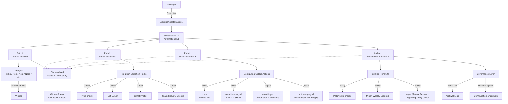

# claudesy‑devkit

**Centralized workflow standardization toolkit for Sentra AI healthcare‑oriented developments.**

`claudesy-devkit` is a deterministic automation suite designed to standardize code quality, security, and CI/CD practices across heterogeneous repositories at Sentra Artificial Intelligence. It ensures that every healthcare‑facing AI project—regardless of tech stack—inherits the same engineering, safety, and governance standards without manual configuration drift.

The toolkit is developed and governed under the oversight of **Professor of Law & Medical**, reflecting Sentra AI’s commitment to **regulatory‑aware, auditable, and safety‑oriented AI development**.

---

## 📚 Problem context

In healthcare‑adjacent AI systems, inconsistent CI/CD pipelines, ad‑hoc linting, and variable security controls create:
- elevated compliance risk,
- harder auditability,
- and increased operational friction across teams.

`claudesy-devkit` solves this by:
- detecting the underlying tech stack (TypeScript, Node, Next, Nest, etc.),
- injecting standardized workflows and pre‑push validation hooks,
- and enforcing automated dependency‑maintenance policies via Renovate.

The result: **immediate alignment with Sentra AI’s engineering and regulatory posture**, without requiring developers to memorize or manually configure templates.

---

## 🧭 Core principles

- **Deterministic tooling**: Every repository that runs `claudesy-devkit` receives the same, predictable configuration set.
- **Minimum configuration, maximum coverage**: Developers provide minimal input; the kit configures linting, formatting, type‑checking, CI workflows, and security scanning.
- **Healthcare‑grade security baseline**: Security‑scan and auto‑fix workflows are installed by default, with clear audit trails compatible with legal, clinical, and regulatory requirements.

---

## 🧩 Complete workflow diagram

The following Mermaid diagram captures the **full lifecycle** of `claudesy-devkit` from repository bootstrapping to production‑ready workflows.



---

## 🧱 Architecture and mechanisms

- **Bootstrapping script**:  
  The entry point is `.\\scripts\\bootstrap.ps1`, which:
  - detects the current repository’s tech stack,
  - collects configuration hints (e.g., `package.json`, `nest`, `next`, `turbo` flags),
  - and orchestrates the injection of hooks and workflows.

- **Stack detection engine**:  
  Analyzes file structure and manifests to infer:
  - whether the project is Next.js, NestJS, Turbo‑monorepo, plain Node, or other identified patterns.
  - Based on the detected stack, it selects appropriate linting, testing, and security rules.

- **Pre‑push validation hooks**:  
  Injected Git hooks ensure that, before any push, a commit:
  - passes type checking,
  - respects linting rules,
  - conforms to defined formatting standards,
  - and satisfies basic security checks (e.g., credentials, secrets, dangerous patterns).

- **CI/CD workflow injection**:  
  The toolkit populates:
  - `ci.yml`: standardized build and test pipeline across all repos.
  - `security-scan.yml`: static application security testing and dependency scanning.
  - `auto-fix.yml`: automated corrective actions for common lint/security issues.
  - `auto-merge.yml`: policy‑driven merge automation aligned with engineering and compliance rules.

- **Dependency automation with Renovate**:  
  The system initializes Renovate with preset policies:
  - **Patch updates**: auto‑merge for fast‑fixing vulnerabilities.
  - **Minor updates**: bundled weekly to reduce noise while maintaining freshness.
  - **Major updates**: require manual review and, where applicable, **legal and regulatory review** before merge.

---

## 🛠 Setup and installation

### Prerequisites

- Windows PowerShell (for initial bootstrapping; future cross‑platform support is planned).
- `git` installed and available in `PATH`.
- `node` (if Node/TypeScript stack is detected).

### Quick start (existing repository)

1. Clone or open the target repository locally.
2. Place the `claudesy-devkit` scripts folder into the root of the repository (or ensure it is reachable):
   - `scripts/bootstrap.ps1`
3. Open PowerShell in the repository root:
   ```powershell
   .\scripts\bootstrap.ps1
   ```
4. Follow the interactive prompts:
   - Confirm stack detection (Next, Nest, Node, Turbo, etc.).
   - Approve hook installation.
   - Confirm workflow injection into `.github/workflows`.

5. Commit the injected changes:
   ```bash
   git add .github/workflows .githooks package.json
   git commit -m "chore: onboarded to claudesy-devkit"
   git push
   ```

After this, the repository will:
- enforce pre‑push checks,
- run standardized CI and security workflows,
- and maintain dependencies according to Sentra AI’s policy.

---

## 🧑‍💼 Usage for developers

### Standard development flow

- **Local development**:  
  Write code as usual; the pre‑push hooks will block pushes that:
  - contain type errors,
  - violate linting or formatting rules,
  - or introduce security‑sensitive patterns.

- **Pull requests**:  
  GitHub Actions will:
  - run builds and tests,
  - perform security scans,
  - and optionally apply automated fixes for non‑breaking issues.

- **Dependencies**:  
  Renovate will open PRs for:
  - patch updates (auto‑merged),
  - minor updates (grouped weekly),
  - major updates (awaiting manual review).

Developers should:
- not bypass hooks or disable security‑scan workflows,
- and consult the engineering or compliance team before merging major‑version dependency changes.

---

## 🏛 Governance and compliance

This toolkit is governed under the **Professor of Law & Medical** framework, ensuring that AI‑development practices at Sentra AI remain aligned with:
- healthcare‑specific regulations,
- data‑protection principles,
- and clinical‑safety requirements.

### Policy enforcement

- **Workflow templates** are version‑controlled and must not be overridden without explicit governance approval.
- **Dependency‑management policies** in `Renovate` are periodically audited to reflect:
  - newly identified vulnerabilities,
  - regulatory‑related library changes,
  - and clinical‑workflow requirements.

### Audit and traceability

- Every configuration injected by `claudesy-devkit` is recorded in:
  - Git commit history,
  - and optionally, in a centralized audit log managed by the engineering organization.
- Configuration snapshots are archived so that:
  - older projects can be reconstructed,
  - and compliance reviews can reconstruct the state of the toolkit at a given point in time.

### Legal and regulatory notes

- Changes to security, testing, or dependency policies affecting healthcare‑facing components must be:
  - reviewed by the **regulatory and compliance team**,
  - and, where applicable, documented in a **risk‑and‑impact assessment**.
- The Professor of Law & Medical reserves the right to:
  - freeze or rollback certain updates,
  - and require enhanced validation steps for modules interacting with clinical or patient‑related data.

---

## 🖼 Virtual character reference

This toolkit is associated with the **virtual persona of Claudesy**, representing the dual role of **Professor of Law & Medical** and **AI architect**. The character is used for:
- documentation,
- workflow illustrations,
- and internal branding of governance‑oriented tooling.

The canonical avatar is stored at:  
`templates/github/workflows/claudesy.png`  

This image shall be used:
- only for internal documentation and workflow diagrams,
- and must not be redistributed outside Sentra AI without explicit permission.

---

## 📜 License and usage rights

`claudesy-devkit` is an internal tool developed and maintained by Sentra Artificial Intelligence. By default, it is:
- made available to Sentra AI projects under defined internal usage policies,
- and may not be redistributed or offered as a public product without explicit governance approval and legal review.

---

## 📮 Support and feedback

For questions, bug reports, or policy‑related concerns, contact:
- **Engineering Governance**: via the internal engineering Slack channel `#sentra-ai-governance`.
- **Legal & Regulatory**: via the compliance ticketing system or the designated legal‑tech liaison.

Feature proposals and major changes to the toolkit’s behavior must be accompanied by:
- a brief impact assessment,
- and, where applicable, a compliance‑checklist review.

---
