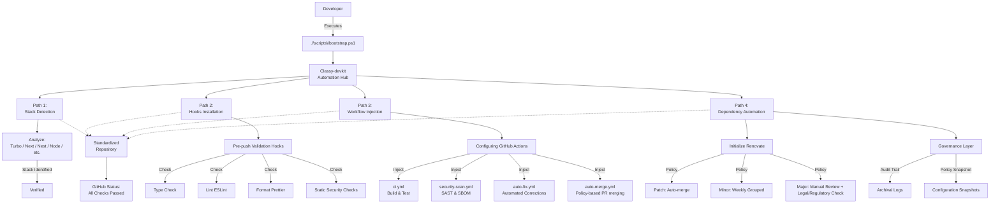

# Classy+

**Centralized Workflow Standardization Toolkit for Healthcare-Oriented Artificial Intelligence Development**


---

## Overview

<table>
  <tr>
    <td width="30%" align="center" valign="middle">
      
      <br/><br/>
      <strong>DR. Classy+</strong>
    </td>
    <td width="70%" valign="top">
      <p><strong>Classy-devkit</strong> is a deterministic automation suite that standardizes code quality, security, and CI/CD practices across heterogeneous repositories. It guarantees that every healthcare-facing Artificial Intelligence project — regardless of underlying tech stack — inherits the same engineering, safety, and governance posture without manual configuration drift.</p>
      <p>The toolkit detects the underlying stack (TypeScript, Node, Next.js, NestJS, Turborepo, etc.), injects standardized GitHub Actions workflows, installs pre-push validation hooks, and enforces dependency-maintenance policies via Renovate — all in a single bootstrap command.</p>
      <p>Originally developed under the oversight of the <strong>Professor of Law &amp; Medical</strong> framework, <code>Classy-devkit</code> reflects a commitment to <strong>regulatory-aware, auditable, and clinically-safe</strong> Artificial Intelligence development. It is released as open tooling for any team building healthcare-adjacent or compliance-sensitive software systems.</p>
    </td>
  </tr>
</table>

---

## Problem Context

In healthcare-adjacent Artificial Intelligence systems, inconsistent CI/CD pipelines, ad-hoc linting, and variable security controls produce:

- elevated regulatory and compliance risk,
- reduced auditability across product lines,
- and increased operational friction between engineering and clinical-legal teams.

`Classy-devkit` resolves this by bootstrapping repositories with a single deterministic configuration set — eliminating template drift, manual onboarding, and undocumented policy variance.

---

## Core Principles

| Principle | Description |
|---|---|
| **Deterministic Tooling** | Every repository onboarded via `Classy-devkit` receives the same predictable configuration set. |
| **Minimum Configuration, Maximum Coverage** | Developers provide minimal input; the kit configures linting, formatting, type-checking, CI workflows, and security scanning. |
| **Healthcare-Grade Security Baseline** | Security-scan and auto-fix workflows are installed by default, with audit trails compatible with legal, clinical, and regulatory requirements. |
| **Governance-First** | All policy changes flow through a structured review framework before propagation. |

---

## Complete Workflow Diagram

The following Mermaid diagram captures the **full lifecycle** of `Classy-devkit` — from repository bootstrapping to production-ready workflows.



---

## Architecture and Mechanisms

### Bootstrapping Script
The entry point is `.\scripts\bootstrap.ps1`, which:
- detects the current repository's tech stack,
- collects configuration hints (e.g., `package.json`, `nest`, `next`, `turbo` flags),
- and orchestrates the injection of hooks and workflows.

### Stack Detection Engine
Analyzes file structure and manifests to infer whether the project is Next.js, NestJS, Turborepo monorepo, plain Node, or another identified pattern. Based on the detected stack, it selects appropriate linting, testing, and security rules.

### Pre-Push Validation Hooks
Injected Git hooks ensure that, before any push, a commit:
- passes type checking,
- respects linting rules,
- conforms to defined formatting standards,
- and satisfies baseline security checks (credentials, secrets, dangerous patterns).

### CI/CD Workflow Injection
The toolkit populates:

| Workflow | Purpose |
|---|---|
| `ci.yml` | Standardized build and test pipeline across all repositories. |
| `security-scan.yml` | Static Application Security Testing (SAST) and dependency scanning. |
| `auto-fix.yml` | Automated corrective actions for common lint and security issues. |
| `auto-merge.yml` | Policy-driven merge automation aligned with engineering and compliance rules. |

### Dependency Automation with Renovate
The system initializes Renovate with preset policies:

| Update Type | Policy |
|---|---|
| **Patch** | Auto-merge for fast vulnerability remediation. |
| **Minor** | Bundled weekly to reduce noise while maintaining freshness. |
| **Major** | Manual review required, including **legal and regulatory review** where applicable. |

---

## Setup and Installation

### Prerequisites

- Windows PowerShell 7.x (initial bootstrapping; cross-platform support planned).
- `git` installed and available in `PATH`.
- `node >= 22.0.0` (if Node/TypeScript stack is detected).

### Quick Start (Existing Repository)

1. Clone or open the target repository locally.
2. Place the `Classy-devkit` scripts folder into the root of the repository (or ensure it is reachable):
   - `scripts/bootstrap.ps1`
3. Open PowerShell in the repository root and execute:
   ```powershell
   .\scripts\bootstrap.ps1
   ```
4. Follow the interactive prompts:
   - Confirm stack detection (Next, Nest, Node, Turbo, etc.).
   - Approve hook installation.
   - Confirm workflow injection into `.github/workflows`.

5. Commit the injected changes:
   ```bash
   git add .github/workflows .githooks package.json
   git commit -m "chore: onboarded to Classy-devkit"
   git push
   ```

After bootstrapping, the repository will:
- enforce pre-push checks,
- run standardized CI and security workflows,
- and maintain dependencies according to the configured governance policy.

---

## Usage for Developers

### Standard Development Flow

**Local Development**
Write code as usual; pre-push hooks will block pushes that contain type errors, violate linting/formatting rules, or introduce security-sensitive patterns.

**Pull Requests**
GitHub Actions will run builds and tests, perform security scans, and optionally apply automated fixes for non-breaking issues.

**Dependencies**
Renovate will open PRs for patch updates (auto-merged), minor updates (grouped weekly), and major updates (awaiting manual review).

### Developer Obligations

- Do **not** bypass hooks or disable security-scan workflows without governance approval.
- Consult the engineering or compliance team before merging major-version dependency changes.
- Report false-positive security blocks via the project issue tracker rather than disabling the rule locally.

---

## Governance and Compliance

This toolkit was designed under the **Professor of Law & Medical** governance framework to ensure that Artificial Intelligence development practices remain aligned with healthcare-specific regulations, data-protection principles, and clinical-safety requirements. Adopting organizations are encouraged to map these mechanisms to their own compliance posture.

### Policy Enforcement

- **Workflow templates** are version-controlled and should not be overridden without explicit governance approval within the adopting organization.
- **Dependency-management policies** in Renovate should be periodically audited to reflect newly identified vulnerabilities, regulatory-related library changes, and clinical-workflow requirements.

### Audit and Traceability

- Every configuration injected by `Classy-devkit` is recorded in Git commit history and, optionally, in a centralized audit log managed by the engineering organization.
- Configuration snapshots are archived so that older projects can be reconstructed and compliance reviews can reproduce the toolkit state at any point in time.

### Legal and Regulatory Notes

- Changes to security, testing, or dependency policies affecting healthcare-facing components should be reviewed by the adopting organization's **regulatory and compliance team** and, where applicable, documented in a **risk-and-impact assessment**.
- Adopters operating in regulated environments should establish their own freeze, rollback, and enhanced-validation procedures for modules interacting with clinical or patient-related data.

---

## License

`Classy-devkit` is released under the **Apache License 2.0**.

This means the toolkit is **free to use, modify, distribute, and integrate** — for personal, academic, commercial, or enterprise purposes — provided the terms of the Apache 2.0 license are respected (notably attribution and inclusion of the license notice).

The toolkit is provided **"as is"**, without warranty of any kind. Adopters operating in regulated environments (healthcare, finance, public sector) remain solely responsible for verifying the toolkit's suitability against their own legal, clinical, and regulatory obligations.

See the [`LICENSE`](./LICENSE) file for the full license text.

---

## Support and Feedback

| Channel | Purpose |
|---|---|
| **GitHub Issues** | Bug reports, feature requests, and policy-related discussion. |
| **GitHub Discussions** | Architectural questions, adoption guidance, and community proposals. |
| **Pull Requests** | Direct contributions following the project's contribution guidelines. |

Feature proposals and major changes to the toolkit's behavior should be accompanied by a brief **impact assessment** and, where applicable, a **compliance-checklist review**.

---

<p align="center">
  <sub>Open-source under the Apache License 2.0</sub>
</p>
