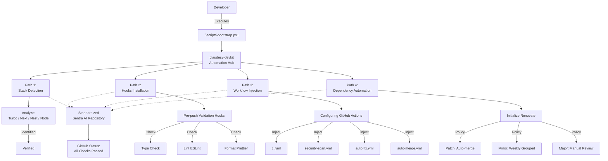

Here is a professional, comprehensive README for the `claudesy-devkit` repository, formatted according to the Sentra standard and incorporating the workflow paths visualized in the previous step.

```markdown
# claudesy-devkit

Centralized workflow standardization toolkit for Sentra AI developments.

**Description:** Ensuring consistent CI/CD pipelines, robust security protocols, and code quality standards across diverse healthcare AI projects is complex and error-prone. `claudesy-devkit` solves this by automating the onboarding of existing repositories, injecting deterministic configurations, pre-push hooks, and dependency management policies tailored to the detected tech stack. This approach provides immediate compliance and standardization without manual setup.

**Principles:** Deterministic tools, minimum configuration, maximum security coverage for healthcare AI.

---

## 🧩 Workflow Overview

`claudesy-devkit` orchestrates repository standardization through four key paths: stack detection, validation hooks installation, automated workflow injection, and dependency maintenance.



---

## 🚀 Quickstart (5 Minutes)

Use this guide to standardize an existing repository.

### 1. Close the Devkit repository
```powershell
git clone [https://github.com/Claudesy/claudesy-devkit.git](https://github.com/Claudesy/claudesy-devkit.git)
cd claudesy-devkit
```

### 2. Run the Initialization Script
Execute the bootstrap script targeting your desired repository.

```powershell
.\scripts\bootstrap.ps1 -TargetRepo "../path/to/your/repo" -Stack "AUTO"
```

The automation hub will execute:
- **Stack Detection:** Auto-detects Turborepo, Next.js, or NestJS environments.
- **Hook Installation:** Installs pre-push hooks for TypeScript, ESLint, and Prettier.
- **Workflow Injection:** Copes standardized `.github/workflows` to the target repo.

### 3. Push and Verify CI
Navigate to your target repository, commit the changes made by the devkit, and push.

```bash
cd ../path/to/your/repo
git add .
git commit -m "chore: inject standardized devkit workflows"
git push
```

### 4. Required Secrets Configuration
To enable all paths of the CI/CD pipeline (especially Path 3: Security & Auto-Fix), configure the following repository secrets.

| Secret | Function | Required? |
|--------|--------|-----------|
| `SEMGREP_APP_TOKEN` | SAST dashboard integration | Optional |
| `SNYK_TOKEN` | SCA vulnerability scanning | Optional |
| `TRUFFLEHOG_REPO_TOKEN` | Verified secret scanning | **Yes** |
| `TURBO_TOKEN` | Remote Caching (Turborepo only) | Mandatory for Turbo |
| `TURBO_TEAM` | Team identifier (Turborepo only) | Mandatory for Turbo |

**Setup Path:** GitHub Repository → Settings → Secrets and variables → Actions

### 5. Dependency Automation (Renovate)
Enable the Renovate application to automatically manage dependency updates based on the devkit's predefined policies.

Install App: [https://github.com/apps/renovate](https://github.com/apps/renovate)

---

## 📦 Delivered Automation

### GitHub Actions Workflows (Path 3)
| Workflow File | Function | Visualized Components |
|------|--------|---|
| `ci.yml` | Full pipeline: build, test, lint. | CI Pipeline flow |
| `security-scan.yml` | Parallel SAST, DAST, and secret detection. | Semgrep / TruffleHog / Trivy |
| `auto-fix.yml` | Fixes linting/formatting errors on specific events. | ESLint / Prettier fixes |
| `auto-merge.yml` | Handles automated merging of non-breaking patches. | Post-CI Auto-merge |

### Pre-Push Hooks (Path 2)
The following validations are enforced locally before allowing a `git push`:
- **TypeScript Verification:** Prevents type errors.
- **ESLint Validation:** Enforces code quality rules.
- **Prettier Formatting:** Ensures consistent code style.

---

## ⚙️ Script Reference

The devkit utilizes PowerShell 7 core scripts.

### `.\scripts\bootstrap.ps1` — Full Initialization
Used to standardize a repo for the first time.

```powershell
.\scripts\bootstrap.ps1 -TargetRepo "../app-repo" -Stack "AUTO" -Force
.\scripts\bootstrap.ps1 -TargetRepo "../mono-repo" -Stack "TURBOREPO"
```

### `.\scripts\sync.ps1` — Update Core Configs
Updates `.github` workflows and hooks without overwriting `package.json` changes.

```powershell
.\scripts\sync.ps1 -TargetRepo "../app-repo"
```

---

## 🔍 Stack Detection Logic (Path 1)

The automation hub detects the repository type based on standard configuration file priorities:

| Priority | Detection File | Identified Stack | Visual Diagram Reference |
|----------|------|-------|---|
| 1 | `turbo.json` | `TURBOREPO` | Turborepo Icon |
| 2 | `next.config.*` | `NEXTJS` | NextJS Icon |
| 3 | `nest-cli.json` | `NESTJS` | NestJS Icon |
| 4 | `package.json` | `NODE` | Node Icon |

---

## 📋 Stack-Specific Considerations

### Turborepo
- Configure `TURBO_TOKEN` and `TURBO_TEAM` for effective remote caching.
- Package manager is dynamically read from the `packageManager` field in `package.json` (pnpm preferred).

### NestJS & Healthcare AI
- **Prisma:** If detected, `prisma generate` is invoked pre-build.
- **PHI/PII Security:** Ensure the `@Exclude()` decorator is utilized on all DTOs handling Protected Health Information/Personally Identifiable Information.

---

## 🆘 Troubleshooting

**Pre-push hook fails on Windows systems?**
Run this command in Bash to fix execution permissions:
```bash
git config core.hooksPath .git/hooks
chmod +x .git/hooks/pre-push
```

**Auto-fix workflow is not triggering?**
Verify that the `workflows` array in `auto-fix.yml` correctly references the exact name of your main `ci.yml` workflow.

---

## 📄 Maintenance

Maintained by Sentra AI Engineering Division.

**Last updated:** 2024-05-20
```
